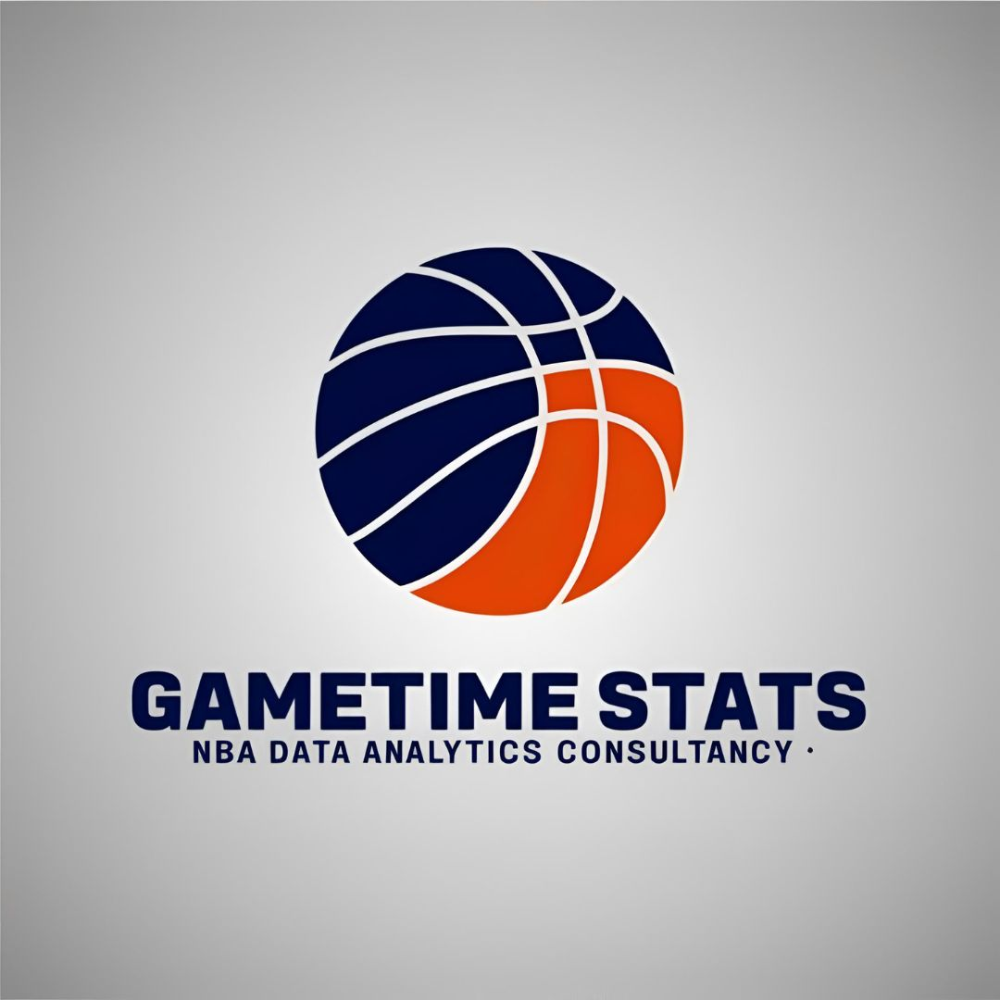

  

# 🏀 Análisis de estadísticas de rendimiento de jugadores de NBA

---

### 👥 **¿Quiénes somos? ¿A qué nos dedicamos?**
Somos **Gametime Stats**, una consultora especializada en el análisis de datos de la **National Basketball Association (NBA)**.

Nuestra misión es apoyar la toma de decisiones para optimizar el rendimiento de los planteles y ayudar a los equipos a alcanzar sus objetivos de temporada, tanto a corto como a largo plazo. Con años de experiencia en el sector, hemos colaborado exitosamente con algunas de las principales franquicias de la liga, logrando excelentes resultados.

---

### ❓ **¿Qué problema buscamos resolver?**
El mundo de la NBA es sumamente dinámico. Cada partido genera una gran cantidad de información, y las estadísticas son fundamentales para alcanzar el éxito. Un equipo competitivo debe contar con todas las herramientas necesarias para sobreponerse a las adversidades, por lo que ningún detalle puede quedar librado al azar.

La selección de la plantilla —incluyendo al jugador franquicia y su equipo de apoyo— requiere un análisis exhaustivo del rendimiento individual y colectivo. Este análisis permite determinar qué contratos renovar, qué jugadores traspasar y cómo evoluciona el rendimiento a lo largo de la temporada regular, entre otros aspectos.

---

### 🎯 **¿Cuál es nuestro objetivo principal?**
El objetivo del proyecto es identificar tendencias y patrones relevantes en las estadísticas de **Los Angeles Lakers** para generar conclusiones que orienten la toma de decisiones sobre renovación de contratos e incorporación de nuevos jugadores, basándose en su rendimiento en la cancha. El análisis abarcará las últimas tres temporadas.

---

### 📊 **¿Qué fuentes de datos usaremos?**
Trabajaremos con el dataset **NBA Database** disponible en Kaggle:  
[🔗 Kaggle - NBA Database](https://www.kaggle.com/datasets/wyattowalsh/basketball)

Esta base de datos contiene información sobre **30 equipos**, más de **4800 jugadores** y **65000 partidos** desde 1946, incluyendo puntajes del 95% de los encuentros.

La información de Kaggle está organizada en **16 tablas CSV** que incluyen estadísticas completas de jugadores (tanto activos como retirados), equipos (actuales y históricos, incluyendo aquellos disueltos o que cambiaron de nombre) y resultados de partidos.
